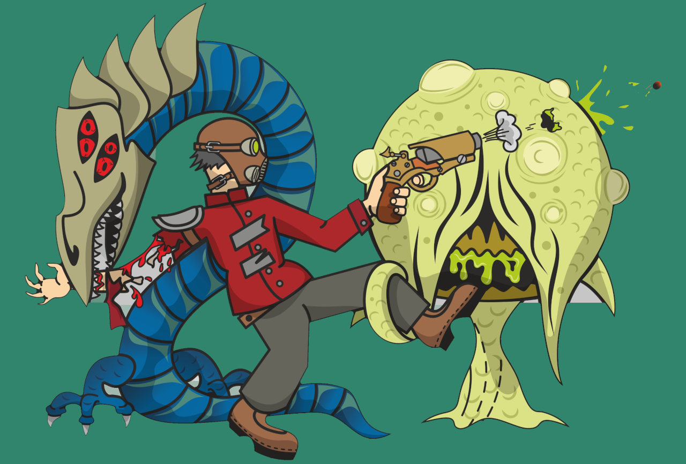

# Swamcave - es6 game

demo on [swampcave.chibiepic.com](https://bajjy.com/swampcave)

3D game engine using only browser features and power es6, HTML5 and CSS. No frameworks, NO CANVAS, no babylon js, etc. All models and graphics are 
**html+css** driven. 

All code is pure ES6, no compilers or third party npm modules.

